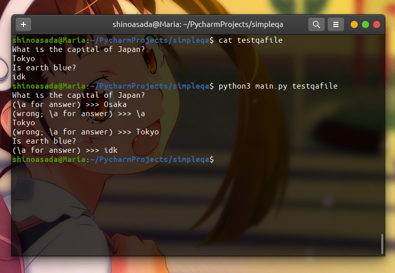

# Description
A simple commandline text flashcard program.


# Installation
Just clone the repository
```shell script
git clone https://github.com/4noAsada/pysimpleqa.git
```
# Usage 
```shell script
python3 main.py [QA files...]
```
# QA file format
Basically, odd lines are questions and even lines are answers. See [testqafile](https://github.com/4noAsada/pysimpleqa/blob/master/testqafile)